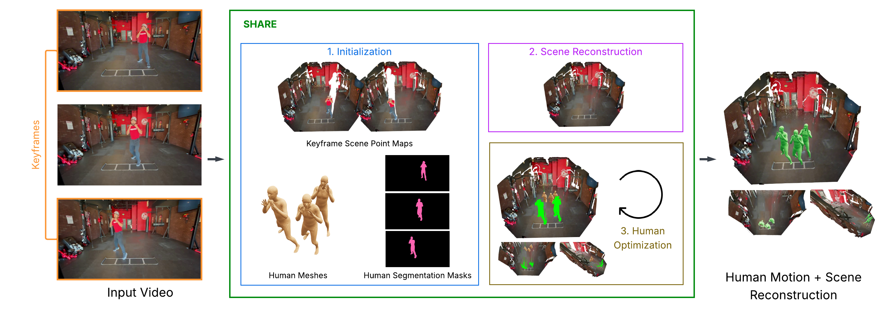

# SHARE

Repository for "SHARE: Scene-Human Aligned Reconstruction", SIGGRAPH Asia Technical Communication 2025.

After initializing the human body mesh and mask using TRAM and scene point maps using MoGe-2, please refer to `method/optimize.py` for the main optimization loop.

Paper (arXiv): https://arxiv.org/abs/2510.15342
